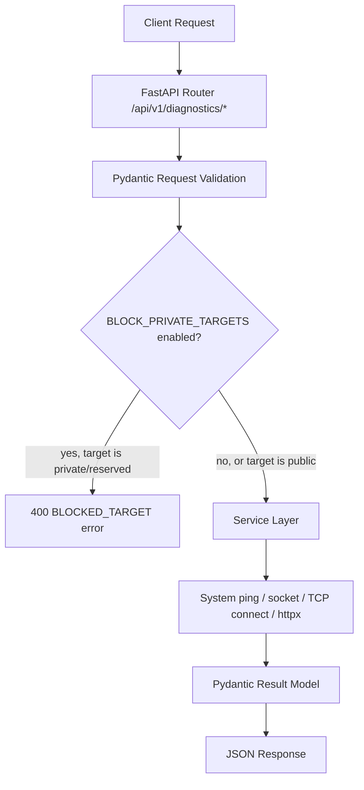

# Network Diagnostic API

A Python/FastAPI backend that exposes common network troubleshooting checks - ping, DNS lookup, TCP port check, HTTP/HTTPS connectivity, latency/jitter measurement, and a combined run - as a REST API.

---

## Table of Contents

1. [Project Overview](#project-overview)
2. [Real-World Problem](#real-world-problem)
3. [Solution](#solution)
4. [Key Features](#key-features)
5. [Technology Stack](#technology-stack)
6. [Project Architecture](#project-architecture)
7. [Project Directory Structure](#project-directory-structure)
8. [System Requirements](#system-requirements)
9. [Installation](#installation)
10. [Environment Configuration](#environment-configuration)
11. [How the Project Works](#how-the-project-works)
12. [Step-by-Step Project Development](#step-by-step-project-development)
13. [File-by-File Build Order](#file-by-file-build-order)
14. [Code Implementation Walkthrough](#code-implementation-walkthrough)
15. [Complete Program Flow](#complete-program-flow)
16. [API Documentation](#api-documentation)
17. [CLI Usage](#cli-usage)
18. [Web Interface](#web-interface)
19. [Database Design](#database-design)
20. [Error Handling](#error-handling)
21. [Security](#security)
22. [Testing](#testing)
23. [Example Usage](#example-usage)
24. [Troubleshooting](#troubleshooting)
25. [Limitations](#limitations)
26. [Future Improvements](#future-improvements)
27. [Learning Outcomes](#learning-outcomes)
28. [Resume Relevance](#resume-relevance)
29. [Git Workflow](#git-workflow)
30. [Project Development Timeline](#project-development-timeline)
31. [Contribution](#contribution)
32. [License](#license)
33. [Author](#author)

---

## Project Overview

Network Diagnostic API is a small, learning-focused FastAPI backend. Instead of shelling out to `ping`, `nslookup`, `curl`, or `nc` one at a time on a machine, you send an HTTP request and get a structured JSON result back. It wraps six diagnostic checks - ping, DNS resolution, TCP port check, HTTP/HTTPS connectivity, multi-sample latency/jitter measurement, and a combined "run everything" check - behind a single, consistent API contract.

It's aimed at developers who want a scriptable, remotely-callable diagnostics service (for example, running it on a jump box or a small VPS and querying it from elsewhere) rather than SSHing in and running individual CLI tools by hand. It's also a reasonably compact reference for how to structure a FastAPI project: routers, Pydantic schemas, a service layer, centralized exception handling, and `asyncio`-friendly wrappers around blocking system calls.

There is no authentication, no persistent storage, and no frontend. This is an API-only project.

## Real-World Problem

Basic network troubleshooting - "is this host up," "does this hostname resolve," "is this port open," "does this URL respond," "what's the round-trip time" - is something almost every developer or ops person does constantly, but it usually means:

- Opening a terminal and running `ping`, `nslookup`/`dig`, `nc -zv`, or `curl -I` separately, one target at a time
- Manually reading and interpreting each tool's differently-formatted output (and dealing with the fact that `ping` output differs between Linux and Windows)
- Having no easy way to trigger these checks from another program, a script, or a remote machine without SSH access
- Re-running the same set of checks (ping + DNS + port + HTTP) as separate manual steps whenever you want a full picture of a host's reachability

None of this is hard individually, but it's repetitive, it's not automatable without gluing several CLI tools together, and the output isn't structured - so it can't easily be consumed by another program or displayed consistently in a dashboard.

## Solution

The API sits between the caller and the operating system's native networking primitives (system `ping`, DNS resolution, raw TCP sockets, and an HTTP client), and turns each check into a validated request/response cycle with a consistent JSON shape.

```text
Client (curl / script / browser via /docs)
        │
        ▼
FastAPI route (app/api/v1/diagnostic.py)
        │
        ▼
Pydantic request validation (app/schemas/requests.py)
        │
        ▼
Optional private/reserved-target policy check
        │
        ▼
Service layer (app/services/*.py)
        │
        ├── subprocess "ping" (ping/latency)
        ├── socket.getaddrinfo (DNS)
        ├── asyncio TCP connect (port)
        └── httpx async client (HTTP/HTTPS)
        │
        ▼
Pydantic response model (app/schemas/responses.py)
        │
        ▼
JSON response back to client
```



Every endpoint returns HTTP 200 for a successfully *executed* check, even if the underlying diagnostic itself failed (e.g., an unreachable host or a closed port) - the `status` field in the JSON body (`"success"` or `"error"`) tells you the outcome of the diagnostic, not the HTTP transport. This is a deliberate distinction; see [How the Project Works](#how-the-project-works).

## Key Features

Everything below is implemented and covered by the test suite as of the current codebase:

- **Ping** (`POST /api/v1/diagnostics/ping`) - sends ICMP echo requests via the OS `ping` binary, parses round-trip times, reports packets sent/received, packet loss %, and min/avg/max RTT.
- **DNS lookup** (`POST /api/v1/diagnostics/dns`) - resolves a hostname to its IP addresses via `socket.getaddrinfo`, with duplicate IPs (from multiple socket types) removed.
- **TCP port check** (`POST /api/v1/diagnostics/port`) - attempts a real TCP handshake against a host:port using `asyncio.open_connection`, and reports whether the port is open along with connection time.
- **HTTP/HTTPS check** (`POST /api/v1/diagnostics/http`) - issues a GET request via `httpx.AsyncClient`, reports the status code, whether the target was reachable, response time, and the final URL if redirects were followed.
- **Latency & jitter measurement** (`POST /api/v1/diagnostics/latency`) - takes multiple ping samples and computes min/avg/max round-trip time plus jitter (mean absolute difference between consecutive samples).
- **Combined diagnostic run** (`POST /api/v1/diagnostics/run`) - runs ping and DNS concurrently (via `asyncio.gather`), and optionally a port check and/or HTTP check if a port/URL is supplied, returning one combined result.
- **Input validation** - hostnames/IPs and ports are validated with Pydantic field validators and a hostname regex before any check runs; malformed input returns a `422` with a consistent error envelope.
- **Optional private-target blocking** - when `BLOCK_PRIVATE_TARGETS=true`, requests targeting a private, loopback, link-local, reserved, or multicast address are rejected with a `400` before any network activity happens.
- **Centralized, structured error handling** - validation errors, diagnostic-specific errors, and unhandled exceptions all go through dedicated FastAPI exception handlers and come back in the same JSON envelope shape.
- **Structured logging** - a single formatter/handler configured at startup, with `httpx`/`httpcore` logging quieted down to `WARNING` unless `LOG_LEVEL=DEBUG`.
- **Interactive API docs** - Swagger UI at `/docs` and ReDoc at `/redoc`, generated automatically by FastAPI from the Pydantic schemas.
- **Health check** (`GET /health`) - returns app name, version, status, and timestamp.

## Technology Stack

| Technology | Purpose |
|---|---|
| Python 3.12+ | Core language |
| FastAPI 0.115.6 | REST API framework, routing, automatic OpenAPI docs |
| Uvicorn 0.34.0 (`[standard]`) | ASGI server used to run the app |
| Pydantic 2.10.4 | Request/response validation and serialization |
| Pydantic-Settings 2.7.1 | Typed, `.env`-driven application configuration |
| httpx 0.28.1 | Async HTTP client used for the HTTP/HTTPS check |
| pytest 8.3.4 | Test runner |
| pytest-asyncio 0.25.1 | Enables `async def` test functions |
| python-dotenv 1.0.1 | Loads `.env` files (used indirectly via Pydantic-Settings) |

There is no database, no ORM, no Docker configuration, and no frontend framework in this codebase - see [Limitations](#limitations) and [Future Improvements](#future-improvements).

## Project Architecture

```text
Client
  │
  ▼
FastAPI app (app/main.py)
  │  - CORS middleware, lifespan logging, exception handlers registered here
  ▼
API layer (app/api/)
  ├── health.py            → GET /health
  └── v1/diagnostic.py     → POST /api/v1/diagnostics/{ping,dns,port,http,latency,run}
  │
  ▼
Schema layer (app/schemas/)
  ├── requests.py    → validates and shapes incoming JSON
  ├── responses.py   → shapes outgoing JSON per check
  └── common.py      → shared status enum, error envelope, health response
  │
  ▼
Service layer (app/services/)
  ├── ping_service.py        → builds/runs OS ping command, parses RTTs
  ├── dns_service.py         → wraps socket.getaddrinfo
  ├── port_service.py        → asyncio TCP connect attempt
  ├── http_service.py        → httpx.AsyncClient GET request
  ├── latency_service.py     → reuses ping's sampling, computes jitter
  └── diagnostic_service.py  → orchestrates ping+dns(+port)(+http) concurrently
  │
  ▼
Support (app/core/, app/utils/)
  ├── core/config.py       → typed Settings, loaded from .env
  ├── core/exceptions.py   → custom exception types + FastAPI exception handlers
  ├── core/logging.py      → logging setup called once at import time
  └── utils/validators.py  → hostname/IP validation, private-address detection
```

The API layer stays thin - each route validates via its Pydantic model, optionally calls `_enforce_target_policy`, and delegates to exactly one service function. All the actual logic (parsing `ping` output, computing jitter, deciding what counts as a "private" address) lives in `services/` and `utils/`, not in the route handlers.

## Project Directory Structure

```text
network-diagnostic-api/
│
├── app/
│   ├── main.py                    # FastAPI app factory, CORS, lifespan, exception handlers
│   ├── api/
│   │   ├── __init__.py            # Combines health + v1 routers into api_router
│   │   ├── health.py              # GET /health
│   │   └── v1/
│   │       ├── __init__.py        # Mounts the diagnostics router under v1
│   │       └── diagnostic.py      # All 6 diagnostic endpoints
│   ├── core/
│   │   ├── config.py              # Settings (env-driven configuration)
│   │   ├── exceptions.py          # Custom exceptions + exception handlers
│   │   └── logging.py             # Logging configuration
│   ├── schemas/
│   │   ├── common.py              # DiagnosticStatus, ResultBase, error/health models
│   │   ├── requests.py            # Per-endpoint request models + validators
│   │   └── responses.py           # Per-endpoint response models
│   ├── services/
│   │   ├── ping_service.py        # Ping execution + output parsing
│   │   ├── dns_service.py         # DNS resolution
│   │   ├── port_service.py        # TCP port check
│   │   ├── http_service.py        # HTTP/HTTPS check
│   │   ├── latency_service.py     # Latency + jitter measurement
│   │   └── diagnostic_service.py  # Combined/orchestrated run
│   └── utils/
│       └── validators.py          # Hostname/IP validation, private-target detection
│
├── tests/
│   ├── conftest.py                 # Shared fixtures: TestClient, real TCP ports, local HTTP server
│   ├── test_health.py
│   ├── test_dns.py
│   ├── test_http.py
│   ├── test_latency.py
│   ├── test_ping.py
│   ├── test_port.py
│   ├── test_run_combined.py
│   └── test_validation.py
│
├── .env.example
├── .gitignore
├── commands-reference.md          # Extended command cheat-sheet (setup, run, test, curl/PowerShell examples)
├── requirements.txt
└── README.md
```

| File / Directory | Purpose |
|---|---|
| `app/main.py` | Creates the FastAPI app, wires up CORS, registers exception handlers, includes all routers. Application entry point for Uvicorn (`app.main:app`). |
| `app/api/health.py` | Single liveness endpoint, useful for load balancers/uptime checks. |
| `app/api/v1/diagnostic.py` | Where all six diagnostic endpoints live: validates the target against the private-target policy, logs the request, and calls the matching service function. |
| `app/core/config.py` | One `Settings` class (Pydantic-Settings) read from `.env`; cached with `lru_cache` so it's only constructed once. |
| `app/core/exceptions.py` | Defines `NetworkDiagnosticError` / `BlockedTargetError` and registers three exception handlers (validation errors, diagnostic errors, and a catch-all) so every error response has the same JSON shape. |
| `app/core/logging.py` | Configures a single `StreamHandler` on the root logger at import time; quiets `httpx`/`httpcore` loggers unless `LOG_LEVEL=DEBUG`. |
| `app/schemas/` | Pydantic models only - no logic. Keeps "what's a valid request/response" separate from "how the check is actually performed." |
| `app/services/` | All actual diagnostic logic. Each function is independently unit-testable without going through FastAPI/HTTP at all. |
| `app/utils/validators.py` | Pure functions for validating hostnames/IPs and detecting private/reserved addresses - used by both `schemas/requests.py` and `api/v1/diagnostic.py`. |
| `tests/` | pytest suite; see [Testing](#testing) for what's actually covered and current pass/fail state. |
| `commands-reference.md` | A longer, standalone cheat-sheet of setup/run/test/curl commands for both bash and PowerShell - worth reading alongside this README. |
| `.env.example` | Every environment variable the app reads, with working defaults - copy to `.env` to customize. |

## System Requirements

- Python 3.12 or newer
- `pip` and `git`
- **A system `ping` binary must be present and executable on the host running the API.** The ping and latency endpoints shell out to it directly (`ping` on Linux/macOS, `ping` on Windows) - if it's missing, both endpoints return a `status: "error"` result rather than crashing the app. This matters in minimal containers, which often don't ship `ping` by default.
- Outbound network access to whatever hosts/URLs you're diagnosing.
- Windows, Linux, or macOS - `ping_service.py` branches on `platform.system()` to build the correct command flags and parse the correct output format for each.
- No database, no external API keys, and no third-party service accounts are required.

## Installation

**macOS / Linux**

```bash
git clone https://github.com/kumaradoss16/network-diagnostic-api.git
cd network-diagnostic-api

python3 -m venv venv
source venv/bin/activate

pip install -r requirements.txt

cp .env.example .env   # optional - every setting already has a working default

uvicorn app.main:app --reload
```

**Windows (PowerShell)**

```powershell
git clone https://github.com/kumaradoss16/network-diagnostic-api.git
cd network-diagnostic-api

python -m venv venv
venv\Scripts\Activate.ps1

pip install -r requirements.txt

copy .env.example .env

uvicorn app.main:app --reload
```

What each step does:

- `python -m venv venv` - creates an isolated environment so this project's dependency versions don't collide with anything else on your machine.
- `pip install -r requirements.txt` - installs FastAPI, Uvicorn, Pydantic, httpx, and the test dependencies pinned in `requirements.txt`.
- `.env.example` → `.env` - this step is genuinely optional here, since every setting in `app/core/config.py` has a default that matches `.env.example`. Copy it only if you actually want to change something (e.g., turn on `BLOCK_PRIVATE_TARGETS`).
- `uvicorn app.main:app --reload` - starts the ASGI server against the `app` object in `app/main.py`, auto-restarting on code changes.

Once it's running, open **http://127.0.0.1:8000/docs** for interactive Swagger UI, or **http://127.0.0.1:8000/redoc** for ReDoc.

## Environment Configuration

All variables below are read by `app/core/config.py` via Pydantic-Settings, with the defaults shown matching `.env.example` exactly:

```text
APP_NAME=Network Diagnostic API
APP_VERSION=1.0.0
ENVIRONMENT=development

HOST=0.0.0.0
PORT=8000

LOG_LEVEL=INFO

CORS_ORIGINS=*

BLOCK_PRIVATE_TARGETS=false

MAX_PING_COUNT=10
MAX_TIMEOUT_SECONDS=10
```

| Variable | Purpose | Default |
|---|---|---|
| `APP_NAME` | Displayed in the FastAPI docs title and the `/health` response. | `Network Diagnostic API` |
| `APP_VERSION` | Displayed in the FastAPI docs and `/health` response. | `1.0.0` |
| `ENVIRONMENT` | Free-text label logged at startup (`development`/`staging`/`production`). Not otherwise used to change app behavior. | `development` |
| `HOST` | Read from settings, but **not currently passed to Uvicorn automatically** - you still specify `--host` on the command line yourself (see `commands-reference.md`). | `0.0.0.0` |
| `PORT` | Same as `HOST` - defined in settings but not auto-applied to the Uvicorn command. | `8000` |
| `LOG_LEVEL` | Root logger level. `DEBUG` also re-enables verbose `httpx`/`httpcore` logging. | `INFO` |
| `CORS_ORIGINS` | Comma-separated allowed origins, or `*` for all. Only `GET`/`POST` methods and no credentials are allowed regardless of this setting. | `*` |
| `BLOCK_PRIVATE_TARGETS` | ⚠️ When `true`, any ping/port/http/latency/run request whose target resolves to a private, loopback, link-local, reserved, or multicast address is rejected with a `400 BLOCKED_TARGET` before any check runs. Useful if you're exposing this API publicly and don't want it used to probe your own internal network (SSRF-style abuse). Off by default. | `false` |
| `MAX_PING_COUNT` | ⚠️ **Defined in `Settings` but not currently read anywhere else in the codebase.** The actual per-request cap on ping/latency `count` is a hardcoded Pydantic field constraint (`le=10`) in `app/schemas/requests.py`, independent of this setting. Changing this value in `.env` has no effect right now. | `10` |
| `MAX_TIMEOUT_SECONDS` | ⚠️ Same situation as `MAX_PING_COUNT` - defined but unused. Per-field `timeout` limits are hardcoded directly in each request schema (`le=10` or `le=30` depending on the endpoint). | `10` |

> Never commit `.env` files, passwords, API keys, tokens, or other secrets to Git. This project has no secrets to manage today (no API keys, no database credentials), but the `.env` pattern is kept in place for when it does.

## How the Project Works

```text
1. Client sends a POST request with a JSON body to a diagnostic endpoint
        ↓
2. FastAPI validates the body against the matching Pydantic request model
   (invalid host/port/URL/count/timeout → 422, request never reaches a service)
        ↓
3. If BLOCK_PRIVATE_TARGETS=true, the target is resolved and checked against
   private/loopback/reserved/link-local/multicast ranges
   (blocked target → 400, request never reaches a service)
        ↓
4. The matching service function runs the actual check
   (subprocess ping / DNS lookup / TCP connect / HTTP GET)
        ↓
5. The service builds a Pydantic result object - status, timing, and
   check-specific fields - regardless of whether the underlying check
   succeeded or failed
        ↓
6. FastAPI serializes the result model to JSON and returns HTTP 200
        ↓
7. The client reads `status` in the JSON body to know if the diagnostic
   itself succeeded ("success") or failed ("error"), separate from the
   HTTP status code
```

The important design decision here: **a diagnostic that reports "this port is closed" or "this host is unreachable" is not a server error.** The HTTP layer only returns a non-200 status for things that are actually wrong with the *request* (422 for bad input, 400 for a blocked target, 500 for a genuine bug). Whether the target itself responded is carried entirely in the `status`/`error` fields of the JSON body. `tests/test_port.py::test_port_endpoint_returns_200_even_when_closed` exists specifically to pin down this behavior.

## Step-by-Step Project Development

This section documents a sensible order to build this project from an empty directory - useful if you're using this repo as a learning reference and want to reproduce it yourself rather than just reading the finished code.

### Step 1 - Project setup

Create the project folder, a virtual environment, and `requirements.txt` with `fastapi`, `uvicorn[standard]`, `pydantic`, `pydantic-settings`, `httpx`, `pytest`, `pytest-asyncio`, and `python-dotenv`. Install everything. Nothing to test yet - this step just gets you a working interpreter and dependency set.

### Step 2 - Configuration (`app/core/config.py`)

Build the `Settings` class before anything else depends on it - almost every other module needs `get_settings()`. Use Pydantic-Settings so config is typed and validated at startup rather than read ad hoc with `os.environ.get()` scattered around the codebase. Test it by importing `get_settings()` in a REPL and confirming the defaults come through.

### Step 3 - Shared schemas (`app/schemas/common.py`)

Define `DiagnosticStatus` (a two-value enum: `success`/`error`) and `ResultBase` (the fields every diagnostic result shares: `status`, `timestamp`, `duration_ms`, `error`). Every other result model inherits from `ResultBase`, so getting this right early avoids repeating four fields six times later.

### Step 4 - Logging (`app/core/logging.py`)

A single `configure_logging()` function that sets up one `StreamHandler` with a consistent format, called once at import time from `main.py`. Built early so every service function written afterward can just call `logging.getLogger(__name__)` and get consistent output immediately.

### Step 5 - Validators (`app/utils/validators.py`)

Hostname regex, IP validation via `ipaddress`, and `is_private_or_reserved()` for the private-target policy. These are pure functions with no FastAPI dependency, which makes them the easiest thing in the project to unit test in isolation - build and test them before wiring them into any endpoint.

### Step 6 - First service + first endpoint (DNS)

DNS is the simplest check (`socket.getaddrinfo`, no subprocess, no raw TCP). Building it first - `app/services/dns_service.py`, then `app/schemas/requests.py`/`responses.py` for just the DNS models, then a minimal `app/api/v1/diagnostic.py` with only `/dns` - proves out the full request → service → response path before tackling anything more complex. Test with `curl -X POST .../dns -d '{"hostname": "example.com"}'`.

### Step 7 - Port check service

`asyncio.open_connection` wrapped in `asyncio.wait_for` for the timeout. This introduces the pattern used for every "did this succeed or fail" service: try the operation, catch the specific exceptions that mean failure (`TimeoutError`, `ConnectionRefusedError`, `OSError`), and always return a result object - never let the exception propagate to FastAPI's default handler.

### Step 8 - HTTP check service

`httpx.AsyncClient` for the actual request; catch `httpx.TimeoutException` and `httpx.RequestError` separately so timeout vs. other connection failures get distinguishable (if currently identically-worded) error messages.

### Step 9 - Ping service

The most involved one: build OS-specific commands (`platform.system()` branch), run them via `subprocess.run` inside `asyncio.to_thread` so the event loop isn't blocked, and parse RTT values out of raw stdout with a regex (Windows and Unix `ping` format their output differently). Build `build_ping_command()` and `parse_rtts()` as small, independently-testable pure functions first, then wire them into `ping_host()`.

### Step 10 - Latency service

Reuses `ping_service._execute_ping()` directly rather than duplicating the subprocess logic, and adds a jitter calculation (mean absolute difference between consecutive samples). Building this after ping - rather than as a copy-paste - is what keeps the two in sync.

### Step 11 - Combined diagnostic service

`asyncio.gather()` over ping + DNS (always) plus port/HTTP (conditionally, if a port/URL was supplied), then combines the individual result objects into one `DiagnosticRunResult`. This is the point where the value of every prior service returning a consistent `ResultBase`-derived shape pays off - the orchestrator doesn't need any special-case handling per check type.

### Step 12 - Centralized exception handling (`app/core/exceptions.py`)

Define `NetworkDiagnosticError`/`BlockedTargetError` and the three exception handlers (validation, diagnostic-specific, catch-all), and register them in `main.py`. Built after the services exist, because you now know exactly which failure modes need a specific error code (`BLOCKED_TARGET`) versus which fall through to the generic `500` handler.

### Step 13 - Wire it all into `main.py`

App factory, CORS middleware, lifespan logging, `register_exception_handlers(app)`, `app.include_router(api_router)`. This is the last step before the app is actually runnable end to end.

### Step 14 - Tests

Write tests per service (pure-function tests for parsing/validation logic that need no I/O, `monkeypatch`-based tests for network calls, and a couple of real-socket/real-local-server fixtures in `conftest.py` for the port and HTTP checks) plus a validation-focused test file hitting the API layer directly. See [Testing](#testing) for what currently passes.

### Step 15 - Documentation

`README.md` and `commands-reference.md`, written last, once the actual endpoint shapes and behavior are settled.

## File-by-File Build Order

```text
01. requirements.txt
02. .gitignore
03. .env.example
04. app/core/config.py
05. app/schemas/common.py
06. app/core/logging.py
07. app/utils/validators.py
08. app/schemas/requests.py
09. app/schemas/responses.py
10. app/services/dns_service.py
11. app/services/port_service.py
12. app/services/http_service.py
13. app/services/ping_service.py
14. app/services/latency_service.py
15. app/services/diagnostic_service.py
16. app/core/exceptions.py
17. app/api/health.py
18. app/api/v1/diagnostic.py
19. app/api/v1/__init__.py
20. app/api/__init__.py
21. app/main.py
22. tests/conftest.py
23. tests/test_*.py
24. README.md / commands-reference.md
```

This order is driven by dependency direction: configuration and shared schemas have no dependents to wait on, so they come first. Each service only depends on `schemas/` and `utils/`, never on `api/`, so services can be written and unit-tested before a single HTTP route exists. `main.py` comes last among the application code because it's the one file that imports everything else.

### Selected files

**`app/core/config.py`**
Purpose: Central, typed configuration loaded from `.env`.
Implemented functionality: `Settings(BaseSettings)` with app metadata, server/log/CORS/policy fields, a `cors_origins_list` property, and a cached `get_settings()` accessor.
Dependencies: `pydantic-settings`.
Depends on: nothing else in the app.
Used by: every other module in `app/`.

**`app/utils/validators.py`**
Purpose: Pure hostname/IP validation and private-address detection.
Implemented functionality: `is_valid_ip`, `is_valid_hostname` (regex-based), `is_valid_target`, `resolve_to_ip`, `is_private_or_reserved`.
Dependencies: standard library only (`ipaddress`, `re`, `socket`).
Depends on: nothing.
Used by: `schemas/requests.py` (field validators) and `api/v1/diagnostic.py` (`_enforce_target_policy`).

**`app/services/ping_service.py`**
Purpose: Executes and parses OS `ping` output; also the RTT-sampling primitive latency measurement reuses.
Implemented functionality: `build_ping_command`, `parse_rtts`, `_run_ping_sync` (blocking subprocess call), `_execute_ping` (thread-offloaded async wrapper), `ping_host`.
Dependencies: standard library (`subprocess`, `platform`, `re`, `asyncio`).
Depends on: `schemas/responses.py`, `schemas/common.py`, `utils/validators.resolve_to_ip`.
Used by: `api/v1/diagnostic.py` and `services/latency_service.py`.

**`app/api/v1/diagnostic.py`**
Purpose: HTTP-facing layer for all six diagnostic checks.
Implemented functionality: route handlers for `/ping`, `/dns`, `/port`, `/http`, `/latency`, `/run`, plus `_enforce_target_policy`.
Dependencies: FastAPI.
Depends on: every module in `schemas/` and `services/`, plus `core/config.py` and `core/exceptions.py`.
Used by: `api/v1/__init__.py`.

## Code Implementation Walkthrough

### Step 1 - Shared result base

```python
class ResultBase(BaseModel):
    status: DiagnosticStatus
    timestamp: datetime = Field(default_factory=lambda: datetime.now(timezone.utc))
    duration_ms: float = Field(..., description="Total time the check took to run, in milliseconds.")
    error: str | None = Field(default=None, description="Human-readable error detail when status is 'error'.")
```

Every diagnostic result - ping, DNS, port, HTTP, latency, and the combined run - inherits from this. `status` and `error` are what let a caller branch on outcome without needing a different response shape per check type. `duration_ms` is measured independently in every service using `time.perf_counter()` around the actual work.

### Step 2 - Target validation

```python
def is_valid_target(value: str) -> bool:
    value = value.strip()
    if not value:
        return False
    return is_valid_ip(value) or is_valid_hostname(value)
```

Used inside Pydantic `field_validator`s on every request model that takes a `host`/`hostname`. This runs *before* a request ever reaches a service function - a malformed host never triggers a subprocess call or a socket connection attempt.

### Step 3 - The private-target policy

```python
def _enforce_target_policy(target: str) -> None:
    settings = get_settings()
    if settings.BLOCK_PRIVATE_TARGETS and is_private_or_reserved(target):
        raise BlockedTargetError(target)
```

Called at the top of every route handler that takes a network target, before the corresponding service runs. `is_private_or_reserved` resolves the target to an IP first (so a hostname that resolves to a private address is also caught, not just literal private IPs).

### Step 4 - A service function's error-handling shape

```python
async def check_port(host: str, port: int, timeout: float = 3.0) -> PortCheckResult:
    start = time.perf_counter()
    writer = None
    try:
        reader, writer = await asyncio.wait_for(
            asyncio.open_connection(host, port), timeout=timeout
        )
        ...
        return PortCheckResult(..., status=DiagnosticStatus.SUCCESS, ...)
    except asyncio.TimeoutError:
        ...
        return PortCheckResult(..., status=DiagnosticStatus.ERROR, error=f"Connection to {host}:{port} time out after {timeout}s.")
    except (ConnectionRefusedError, OSError) as exc:
        ...
        return PortCheckResult(..., status=DiagnosticStatus.ERROR, error=str(exc))
    finally:
        if writer is not None:
            writer.close()
```

Every service (`ping`, `dns`, `port`, `http`, `latency`) follows this same shape: try the operation, catch the specific exceptions that represent a *diagnostic* failure (not a bug), and always return a fully-formed result object rather than letting the exception bubble up. This is what lets the route handlers stay thin and lets a failed diagnostic still return HTTP 200.

### Step 5 - Orchestration

```python
tasks: dict[str, Awaitable[ResultBase]] = {
    "ping": ping_host(host, count=ping_count, timeout=timeout),
    "dns": resolve_dns(host),
}
if port is not None:
    tasks["port"] = check_port(host, port, timeout=timeout)
if url is not None:
    tasks["http"] = check_http(str(url), timeout=timeout)

results = dict(zip(tasks.keys(), await asyncio.gather(*tasks.values())))
```

`run_diagnostics` builds a dict of coroutines conditionally, then awaits all of them concurrently with a single `asyncio.gather`. Because ping, DNS, port, and HTTP checks are all independent I/O-bound operations, running them concurrently rather than sequentially is a meaningful latency win on the combined `/run` endpoint.

## Complete Program Flow

```text
uvicorn app.main:app
 │
 ├── configure_logging()          # called at module import time
 ├── get_settings()                # cached Settings instance
 │
 └── FastAPI app
      ├── lifespan()               # logs startup/shutdown
      ├── CORSMiddleware
      ├── register_exception_handlers(app)
      └── include_router(api_router)
             ├── health_router  → GET /health
             └── v1_router
                    └── diagnostic_router
                           ├── POST /api/v1/diagnostics/ping     → ping_host()
                           ├── POST /api/v1/diagnostics/dns      → resolve_dns()
                           ├── POST /api/v1/diagnostics/port     → check_port()
                           ├── POST /api/v1/diagnostics/http     → check_http()
                           ├── POST /api/v1/diagnostics/latency  → measure_latency()
                           └── POST /api/v1/diagnostics/run      → run_diagnostics()
                                                                       ├── ping_host()
                                                                       ├── resolve_dns()
                                                                       ├── check_port()   (optional)
                                                                       └── check_http()   (optional)
```

## API Documentation

Base URL (default local run): `http://127.0.0.1:8000`
Authentication: none.

---

**`GET /health`**

Response `200`:
```json
{
  "status": "ok",
  "app_name": "Network Diagnostic API",
  "version": "1.0.0",
  "timestamp": "2026-08-29T10:00:00Z"
}
```

---

**`POST /api/v1/diagnostics/ping`**

Request:
```json
{ "host": "example.com", "count": 4, "timeout": 2.0 }
```
`count`: 1–10 (default 4). `timeout`: 0–10s per packet (default 2.0).

Response `200`:
```json
{
  "status": "success",
  "timestamp": "2026-08-29T10:00:00Z",
  "duration_ms": 210.5,
  "error": null,
  "target": "example.com",
  "resolved_ip": "93.184.216.34",
  "packets_sent": 4,
  "packets_received": 4,
  "packet_loss_percent": 0.0,
  "min_rtt_ms": 10.8,
  "avg_rtt_ms": 11.4,
  "max_rtt_ms": 12.1
}
```

---

**`POST /api/v1/diagnostics/dns`**

Request:
```json
{ "hostname": "example.com" }
```

Response `200`:
```json
{
  "status": "success",
  "duration_ms": 5.1,
  "error": null,
  "hostname": "example.com",
  "ip_addresses": ["93.184.216.34"],
  "resolution_time_ms": 5.1
}
```

---

**`POST /api/v1/diagnostics/port`**

Request:
```json
{ "host": "example.com", "port": 443, "timeout": 3.0 }
```
`port`: 1–65535. `timeout`: 0–10s (default 3.0).

Response `200` (open):
```json
{ "status": "success", "duration_ms": 22.0, "error": null, "host": "example.com", "port": 443, "is_open": true, "response_time_ms": 22.0 }
```

Response `200` (closed - this is not an HTTP error):
```json
{ "status": "error", "duration_ms": 3001.2, "error": "Connection to example.com:9999 time out after 3.0s.", "host": "example.com", "port": 9999, "is_open": false, "response_time_ms": 3001.2 }
```

---

**`POST /api/v1/diagnostics/http`**

Request:
```json
{ "url": "https://example.com", "timeout": 5.0, "follow_redirects": true }
```
`timeout`: 0–30s (default 5.0).

Response `200`:
```json
{
  "status": "success",
  "duration_ms": 130.4,
  "error": null,
  "url": "https://example.com",
  "status_code": 200,
  "is_reachable": true,
  "response_time_ms": 130.4,
  "final_url": null
}
```

---

**`POST /api/v1/diagnostics/latency`**

Request:
```json
{ "host": "example.com", "count": 5, "timeout": 2.0 }
```
`count`: 2–20 (default 5).

Response `200`:
```json
{
  "status": "success",
  "duration_ms": 260.0,
  "error": null,
  "target": "example.com",
  "samples_ms": [10.0, 11.0, 9.5, 10.5, 10.0],
  "packets_sent": 5,
  "packets_received": 5,
  "packet_loss_percent": 0.0,
  "min_ms": 9.5,
  "avg_ms": 10.2,
  "max_ms": 11.0,
  "jitter_ms": 1.0
}
```
> ⚠️ **Known bug** - see [Limitations](#limitations): `packet_loss_percent` is currently computed incorrectly in `latency_service.py` due to an operator-precedence error. On a fully successful run (all samples received), the API currently returns `-99.0` here instead of `0.0`. The value shown above is what the field is *intended* to represent, not what the code currently returns.

---

**`POST /api/v1/diagnostics/run`**

Request:
```json
{ "host": "example.com", "port": 443, "url": "https://example.com", "ping_count": 4, "timeout": 3.0 }
```
`port` and `url` are optional - omitting both runs only ping + DNS.

Response `200`: a `DiagnosticRunResult` combining `ping`, `dns`, and optionally `port`/`http` (each shaped exactly like their individual endpoint's response), plus a top-level `status` that is `"success"` only if every sub-check succeeded.

---

**Error responses** (all endpoints, consistent envelope):

`422` - request validation failed:
```json
{ "success": false, "error": { "code": "VALIDATION_ERROR", "message": "Request validation failed.", "details": [...] }, "timestamp": "..." }
```

`400` - target blocked by policy (only when `BLOCK_PRIVATE_TARGETS=true`):
```json
{ "success": false, "error": { "code": "BLOCKED_TARGET", "message": "Target '10.0.0.5' resolves to a private, loopback, or reserved address, which is not permitted by this server's configuration.", "details": null }, "timestamp": "..." }
```

`500` - unhandled server error:
```json
{ "success": false, "error": { "code": "INTERNAL_SERVER_ERROR", "message": "An unexpected error occurred. Please try again later.", "details": null }, "timestamp": "..." }
```

## CLI Usage

This project has no command-line interface - it is an HTTP API only. Interact with it via `curl`/`Invoke-RestMethod`/an HTTP client, or through the interactive docs at `/docs`. See [`commands-reference.md`](./commands-reference.md) for a full set of copy-pasteable `curl` and PowerShell examples for every endpoint.

## Web Interface

Not applicable - this project has no bundled frontend, dashboard, or web UI. `/docs` (Swagger UI) and `/redoc` (ReDoc) are FastAPI's auto-generated interactive API explorers, not a custom web interface built as part of this project.

## Database Design

Not applicable - this project has no database. Every diagnostic result is computed on demand and returned directly in the response; nothing is persisted between requests.

## Error Handling

| Situation | What happens |
|---|---|
| Invalid input (bad hostname, out-of-range port/count/timeout, malformed URL) | Pydantic validation fails before any service runs → `422` with `VALIDATION_ERROR` code and per-field details. |
| Target is private/loopback/reserved and `BLOCK_PRIVATE_TARGETS=true` | `_enforce_target_policy` raises `BlockedTargetError` → `400` with `BLOCKED_TARGET` code. |
| Host unreachable / DNS failure / port closed / HTTP unreachable / timeout | Caught inside the relevant service function → HTTP `200` with `status: "error"` and a human-readable `error` field in the body. This is treated as a valid diagnostic outcome, not a server error. |
| `ping` binary missing from the host OS | Caught as `PingExecutionError` inside `ping_service.py` → `200` with `status: "error"`, `error: "The 'ping' utility is not available on this server."` |
| Any unexpected/unhandled exception | Caught by the catch-all `Exception` handler in `core/exceptions.py`, logged with a full traceback server-side, and returned to the client as a generic `500 INTERNAL_SERVER_ERROR` - no internal detail or stack trace is exposed in the response. |

## Security

Implemented:

- **Input validation on every field** - hostnames/IPs via regex and `ipaddress`, ports via Pydantic range constraints, URLs via Pydantic's `AnyHttpUrl`, all before any network call is made.
- **Optional SSRF-style guardrail** - `BLOCK_PRIVATE_TARGETS` (default `false`) rejects requests targeting private, loopback, link-local, reserved, or multicast addresses, which matters if this API is ever exposed somewhere that shouldn't be able to probe internal infrastructure.
- **Restricted CORS methods** - only `GET`/`POST` are allowed, and `allow_credentials=False` regardless of `CORS_ORIGINS`.
- **No stack traces or internal detail leaked to clients** - the catch-all exception handler always returns a generic message; full detail is only logged server-side.

Not implemented (see [Limitations](#limitations) / [Future Improvements](#future-improvements)):

- No authentication or authorization of any kind - every endpoint is open to anyone who can reach the server.
- No rate limiting - a client can call any endpoint, including the `run` endpoint that fans out to multiple checks, as many times as it wants.
- `CORS_ORIGINS` defaults to `*` (all origins allowed).
- `BLOCK_PRIVATE_TARGETS` defaults to `false` - the SSRF-style guardrail is opt-in, not on by default.

**Authorized Use Only.** This API can be used to probe hosts, ports, and URLs that a caller supplies - including, if `BLOCK_PRIVATE_TARGETS` is left at its default of `false`, internal/private network addresses reachable from wherever the API is deployed. Only run this against hosts and networks you're authorized to test, and treat any public-facing deployment as something that needs authentication and rate limiting layered in front of it - neither exists yet in this codebase.

## Testing

Framework: `pytest` + `pytest-asyncio`.
Run everything:

```bash
pytest -v
```

Run a single file or test:
```bash
pytest tests/test_ping.py -v
pytest tests/test_ping.py::test_parse_rtts_linux_output -v
pytest -k "dns"
```

**Actual current result when run against this codebase: 30 passed, 4 failed.**

What's covered:
- `test_health.py` - the `/health` endpoint shape.
- `test_dns.py` - DNS resolution success/failure at the service level (mocked `socket.getaddrinfo`) and at the endpoint level.
- `test_ping.py` - pure-function tests for OS-specific command building and RTT parsing (Linux and Windows output formats), plus `ping_host()` behavior with the subprocess call mocked.
- `test_port.py` - real local TCP sockets (via `conftest.py` fixtures) for genuinely open and genuinely closed ports, plus confirming the endpoint returns `200` even when the port is closed.
- `test_http.py` - a real local `http.server` instance for the reachable case, plus a connection-refused case against an unbound port.
- `test_latency.py` - jitter calculation edge cases, and `measure_latency()` with the ping sampling mocked out.
- `test_run_combined.py` - the orchestrator with all four sub-checks mocked, confirming concurrent execution, optional-check omission, and overall status roll-up.
- `test_validation.py` - confirms malformed input on every endpoint returns `422` with the standard error envelope.

**Known failing tests, and why**, as observed when actually running the suite:

- `tests/test_dns.py::test_dns_endpoint_success` and `tests/test_run_combined.py::test_run_endpoint_returns_combined_shape` fail with `ModuleNotFoundError: No module named 'app.api.v1.diagnostics'`. These two tests `monkeypatch.setattr("app.api.v1.diagnostics....")` (plural), but the actual module is `app/api/v1/diagnostic.py` (singular) - almost certainly leftover from a file rename that the tests weren't updated for.
- `tests/test_latency.py::test_measure_latency_success` fails because `packet_loss_percent` comes back as `-99.0` instead of `0.0`. This traces to a real bug in `latency_service.py`: `round(1 - len(samples) / count * 100, 2)` applies operator precedence as `1 - ((len(samples)/count) * 100)` rather than the intended `(1 - len(samples)/count) * 100`.
- `tests/test_ping.py::test_ping_host_success` fails because the test monkeypatches `asyncio.create_subprocess_exec`, but the actual implementation in `ping_service.py` uses `subprocess.run` inside `asyncio.to_thread` - a different execution path - so the mock is never invoked and the real `ping` binary is attempted instead.

Tests do not touch real external hosts for the DNS, latency, and most ping scenarios (mocked at the `socket`/subprocess boundary); the port and HTTP tests use real local sockets/servers bound to `127.0.0.1`, not external network calls. No code coverage tooling (e.g. `pytest-cov`) is configured in this repository, so no coverage percentage is reported here.

`commands-reference.md` mentions checking `pytest.ini` for `asyncio_mode = strict` as a troubleshooting step; no `pytest.ini` (or `pyproject.toml`/`setup.cfg` with pytest config) currently exists in the repository. `[TODO: Add a pytest.ini or pyproject.toml with asyncio_mode configured, or update commands-reference.md to remove this reference.]`

## Example Usage

```text
Input: a hostname and how many packets to send
   ↓
POST /api/v1/diagnostics/ping  {"host": "example.com", "count": 4}
   ↓
ping_host() shells out to the OS ping command, parses RTTs
   ↓
Output: JSON with packet loss %, min/avg/max RTT
```

```bash
curl -X POST http://127.0.0.1:8000/api/v1/diagnostics/ping \
  -H "Content-Type: application/json" \
  -d '{"host": "example.com", "count": 4, "timeout": 2}'
```

See [API Documentation](#api-documentation) above for the full request/response shape of every endpoint, and [`commands-reference.md`](./commands-reference.md) for every endpoint in both `curl` and PowerShell form.

## Troubleshooting

### Problem: `ModuleNotFoundError: No module named 'app'` when running `pytest` or `uvicorn`

**Cause:** You're not running the command from the project root - the folder that directly contains `app/`.

**Solution:**
```bash
cd network-diagnostic-api
uvicorn app.main:app --reload
```

### Problem: Ping and latency endpoints always return `status: "error"` with `"The 'ping' utility is not available on this server."`

**Cause:** The `ping` binary isn't installed/available in the environment the API is running in - common in minimal Docker base images or restricted sandboxes.

**Solution:** Install a `ping` utility (e.g. `apt-get install -y iputils-ping` on Debian/Ubuntu-based images), or accept that ping/latency checks won't work in that environment and rely on the DNS/port/HTTP checks instead.

### Problem: `GET /` returns `404`

**Cause:** Expected - there is no root route defined in this project.

**Solution:** Use `/health`, `/docs`, or one of the `/api/v1/diagnostics/*` endpoints.

### Problem: `packet_loss_percent` on the `/latency` endpoint shows a large negative number instead of `0.0` on a fully successful run

**Cause:** A real bug - see [Testing](#testing) and [Limitations](#limitations) for the exact line and cause.

**Solution:** Not yet fixed in this codebase. `[TODO: Fix operator precedence in latency_service.py's packet_loss_percent calculation.]`

### Problem: `Invoke-WebRequest : Cannot bind parameter 'Headers'` in PowerShell

**Cause:** Plain `curl` in PowerShell is aliased to `Invoke-WebRequest`, which doesn't accept the same flags as real `curl`.

**Solution:** Use `Invoke-RestMethod` or call `curl.exe` explicitly. See `commands-reference.md` section 4 for exact syntax.

### Problem: Port 8000 already in use

**Solution:**
```bash
uvicorn app.main:app --reload --port 8001
```

## Limitations

- **No authentication, authorization, or rate limiting** - anyone who can reach the server can call any endpoint any number of times.
- **`ping`/latency checks depend on a system `ping` binary being present** and are subject to whatever ICMP restrictions exist on the network the server runs on (many cloud/container environments block or deprioritize ICMP).
- **`packet_loss_percent` on `/latency` is currently computed with an operator-precedence bug**, producing incorrect (negative) values instead of `0.0`–`100.0` - confirmed by an actually-failing test (see [Testing](#testing)).
- **`MAX_PING_COUNT` and `MAX_TIMEOUT_SECONDS` settings exist but are not enforced anywhere** - the real per-request limits are hardcoded Pydantic field constraints in `app/schemas/requests.py`, independent of these `.env` values.
- **`HOST`/`PORT` settings are defined but not automatically applied** - you still pass `--host`/`--port` to the `uvicorn` command yourself.
- **Two test-suite files reference a stale module path** (`app.api.v1.diagnostics`, plural) that no longer exists, causing 2 of the 34 tests to fail on import rather than on assertion.
- **`ping_service.py`'s actual subprocess execution (`subprocess.run` in a thread) doesn't match what `test_ping_host_success` mocks (`asyncio.create_subprocess_exec`)**, so that test currently fails by falling through to a real (and, in this environment, missing) `ping` binary.
- **No persistent storage, no request history, no scheduled/background monitoring** - every check is synchronous and on-demand.
- **Accuracy of ping-based checks depends on the OS's own `ping` implementation and its output format**, which the regex-based parser assumes follows the standard Linux/macOS or Windows format; unusual `ping` implementations or locales could break parsing.
- **CORS defaults to allowing all origins (`*`)** and private-target blocking defaults to `off` - both need explicit configuration to lock down.

## Future Improvements

- Fix the `packet_loss_percent` calculation bug in `latency_service.py`
- Fix or remove the stale `app.api.v1.diagnostics` monkeypatch targets in `test_dns.py` and `test_run_combined.py`
- Align `test_ping_host_success` with the actual `subprocess.run`-based implementation (or vice versa)
- Wire `HOST`/`PORT`/`MAX_PING_COUNT`/`MAX_TIMEOUT_SECONDS` settings into actual runtime behavior, or remove them if they're not meant to be used
- Add authentication (API key or similar) for non-local deployments
- Add rate limiting per client/IP
- Add a `pytest.ini`/`pyproject.toml` with `asyncio_mode` configured, and align it with what `commands-reference.md` describes
- Add Docker packaging
- Add a persistence layer for diagnostic history
- Add scheduled/background monitoring instead of purely on-demand checks
- Add a small web dashboard for triggering checks without `curl`/`/docs`

## Learning Outcomes

Building or studying this project touches:

- **FastAPI fundamentals** - routers, dependency-free service layering, `lifespan` events, automatic OpenAPI generation.
- **Pydantic v2** - field validators, nested models, `AnyHttpUrl`, settings management via Pydantic-Settings.
- **Python `asyncio`** - `asyncio.gather` for concurrent I/O, `asyncio.wait_for` for timeouts, `asyncio.to_thread`/`run_in_executor` for offloading blocking calls (subprocess, `socket.getaddrinfo`) off the event loop.
- **Networking fundamentals** - how `ping`/ICMP, DNS resolution, TCP handshakes, and HTTP requests actually work at the protocol level, and how their failure modes differ.
- **Cross-platform subprocess handling** - building and parsing OS-specific CLI output (`ping` on Windows vs. Linux/macOS).
- **API error-handling design** - centralized exception handlers, consistent error envelopes, and the distinction between "the request was malformed" vs. "the diagnostic itself failed."
- **Testing async code** - `pytest-asyncio`, `monkeypatch` for isolating I/O, and using real local sockets/servers instead of mocks where that's actually simpler and more trustworthy.
- **Reading code critically** - this README itself was written by actually running the test suite and finding real bugs, not by trusting docstrings or filenames.

## Resume Relevance

Based only on what's actually implemented in this codebase:

- Built a Python/FastAPI REST API exposing network diagnostic checks (ICMP ping, DNS resolution, TCP port scanning, HTTP/HTTPS connectivity, latency/jitter measurement) with async I/O and concurrent request orchestration via `asyncio.gather`.
- Designed a layered architecture (API routes → Pydantic schemas → service layer → OS/network primitives) with centralized exception handling and a consistent JSON error envelope across all endpoints.
- Wrote a pytest suite covering pure-function logic, mocked I/O boundaries, and real local socket/HTTP-server fixtures for network-dependent code paths.

`[TODO: Add specific outcomes if applicable - e.g., deployment target, usage context - only if factually accurate.]`

## Git Workflow

```bash
git init
git add .
git commit -m "Initial project setup"
git branch -M main
git remote add origin https://github.com/kumaradoss16/network-diagnostic-api.git
git push -u origin main
```

Suggested branch structure for ongoing feature work:

```text
main
 │
 ├── fix/latency-packet-loss-calculation
 ├── fix/stale-monkeypatch-module-paths
 ├── feature/rate-limiting
 └── feature/docker-packaging
```

Commit at logical checkpoints - after a service function works and is tested, after a route is wired up and manually verified via `/docs`, and after a bug fix has a regression test attached to it - rather than one large commit per session.

## Project Development Timeline

A realistic pace for a project of this size, working part-time:

```text
Day 1 → Project setup, config, shared schemas, logging
Day 2 → Validators + DNS service/endpoint end to end
Day 3 → Port check + HTTP check services/endpoints
Day 4 → Ping service (command building, output parsing, subprocess wiring)
Day 5 → Latency service + combined diagnostic orchestration
Day 6 → Centralized exception handling, wiring main.py together
Day 7 → Test suite
Day 8 → Documentation, bug fixes found while writing docs/tests
```

## Contribution

This is currently a solo/learning project.

1. Fork the repository
2. Create a branch (`git checkout -b fix/latency-packet-loss`)
3. Make your changes
4. Run `pytest -v` and confirm you haven't introduced new failures (note the suite currently has 4 pre-existing failures - see [Testing](#testing))
5. Commit your changes with a clear message
6. Open a pull request describing what changed and why

## License

`[TODO: Choose and add a project license]` - no `LICENSE` file currently exists in this repository.

## Author

`[TODO: Add author name]` - GitHub: [kumaradoss16](https://github.com/kumaradoss16)
